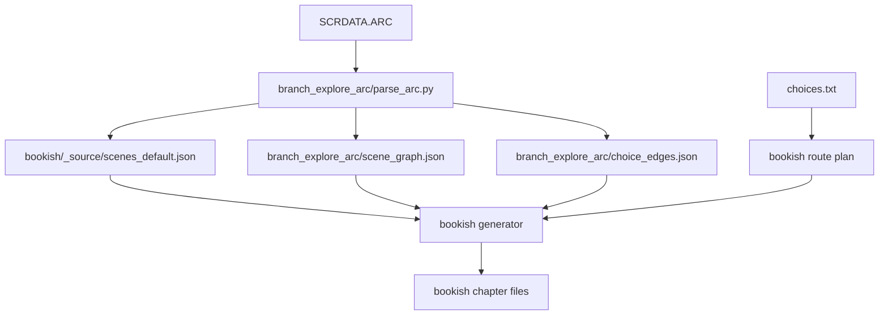
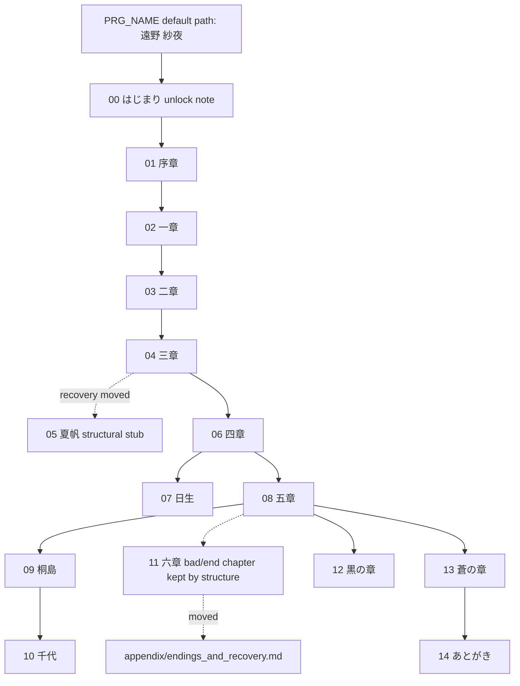

# Bookish Design Draft

## Goal

Create a readable script edition ordered by the walkthrough ladder in `choices.txt`, while preserving the game's original large-chapter file structure.

This is not a full engine trace. It is a book-like reading edition:

- file boundaries follow the original large chapters
- scene index controls the primary order inside each chapter file
- walkthrough order controls which choices/route variants are rendered inside each scene
- mark only the selected choice at choice points
- hide bad ends from the main reading flow
- place meaningful alternate endings or scene-recovery material after the nearest relevant true-ending section
- put the original player-name setup at the beginning, silently selecting the default name
- note the opening Toya/protagonist outing as a second-playthrough unlock scene, but omit it from reader-facing body text
- put internal story scripts from the end of the extracted ARC text into appendix files
- split scenes with horizontal rules
- omit scene numbers, script names, route conditions, and technical metadata from the reader-facing text

## Source Layers



Current completed source layer:

- `bookish/_source/scenes_default.json`
- `bookish/_source/archive_order_default.md`

This layer has already normalized protagonist naming:

- `PLAYER` -> `遠野　紗夜`
- `%s` -> `紗夜`
- adjacent duplicate `%s` variants folded

## File Structure

Files should match the original large chapter count and order:

```text
00_hajimari.md
01_prologue.md
02_chapter1.md
03_chapter2.md
04_chapter3.md
05_natsuko.md
06_chapter4.md
07_hinase.md
08_chapter5.md
09_kirishima.md
10_chiyo.md
11_chapter6.md
12_kuro.md
13_ao.md
14_atogaki.md
```

These correspond to the ARC chapter groups:

| File | Original chapter | Notes |
|---|---|---|
| `00_hajimari.md` | はじまり | Includes the original `PRG_NAME.scr` default-name path. The opening Toya/protagonist outing is noted as second-playthrough-only and omitted from reader-facing body text. |
| `01_prologue.md` | 序章 | Shared prologue using the canonical common choices from the start of `choices.txt`; no route/recovery headings. |
| `02_chapter1.md` | 一章 | Scenes before the `choices.txt` 全員共通SAVE are rendered as one common flow; route sections start after that boundary. Recovery/other-ending branches are moved to appendix. |
| `03_chapter2.md` | 二章 | Common/different route sections. |
| `04_chapter3.md` | 三章 | Common/different route sections. |
| `05_natsuko.md` | 夏帆 | Kept for original chapter count; 夏帆-結末 is moved to `appendix/endings_and_recovery.md`. |
| `06_chapter4.md` | 四章 | Major route fork hub; contains route-difference sections. |
| `07_hinase.md` | 日生 | 日生 route chapter, ending at the true-ending reading flow. |
| `08_chapter5.md` | 五章 | Route-difference chapter for 桐島/千代/十夜/蒼 branches. |
| `09_kirishima.md` | 桐島 | 桐島 route chapter. |
| `10_chiyo.md` | 千代 | Separate 千代 route chapter, not nested under 桐島. |
| `11_chapter6.md` | 六章 | Kept for original chapter count, but 六章-終 is treated as bad/end content and omitted from main reading. |
| `12_kuro.md` | 黒の章 | 遠野十夜 route chapter; 黒の章-終 omitted as bad/end content. |
| `13_ao.md` | 蒼の章 | 蒼 route chapter, ending at the true-ending reading flow. |
| `14_atogaki.md` | あとがき | Afterword. |

## Chapter-Internal Ladder

The route ladder is an internal organization inside chapter files, not the file boundary.



Inside a chapter file, scene order is primary. For each scene, the generator renders the shared body once, then route variants only when their selected-flow body differs. This avoids moving early route-difference scenes behind later common scenes.

```text
# 一章

## 全員共通

...

---

## 蒼

> 選択：学校に残る

...

---

## 全員共通

...

---

## 桐島七葵

...
```

If a passage is genuinely shared by all routes, it belongs under `全員共通`. If it differs for Ao, the Ao version should be shown fully under `蒼`, not summarized as a diff. Identical recovery/appendix route bodies are suppressed within the same scene so route-recovery metadata does not duplicate unchanged text.

## Ao Policy

Ao should be treated as a complete story after the all-route common material, not merely a late route branch or a patch over the non-Ao route.

Reason:

- `choices.txt` gives Ao different selections already in 一章, 二章, 三章, 四章, and 五章.
- ARC data confirms these choices can lead through different scenes before 蒼の章 starts.
- The readable experience should let Ao stand as one continuous story, except for truly all-route common material.

Decision:

- put truly shared text once under `全員共通`
- put all Ao-specific common-difference scenes under `蒼` sections in the relevant original chapter files
- put 蒼の章 itself in `13_ao.md`
- move 蒼-specific recovery material to `appendix/endings_and_recovery.md`

## Bad / Ending Policy

Bad/end branches are not shown in the main reading flow:

- 一章-終
- 日生-終１ / 日生-終２
- 六章-終
- 黒の章-終
- 蒼の章-終

`11_chapter6.md` still exists because file count follows original chapters. If all selected material for it is classified as bad/end content, the file should contain a short relocation note rather than the full bad ending text.

Walkthrough recovery, other endings, and bad/end scenes should be excluded from the main chapter files and collected in one appendix file:

- `appendix/endings_and_recovery.md` contains the extracted recovery/other-ending route blocks from `choices.txt`.
- `appendix/endings_and_recovery.md` also contains direct bad/end terminal scenes such as 一章-終, 日生-終, 六章-終, 黒の章-終, and 蒼の章-終.
- `05_natsuko.md` and `11_chapter6.md` remain as structural stubs so the file count still follows the original chapter count.
- 千代 remains a separate true route file in `10_chiyo.md`, not an appendix item.

## Formatting Rules

Name setup at the beginning of `00_hajimari.md`:

```markdown
# 名前

貴方のお名前は？
私の名前？　私の名前は…………
ええ、そうでしたね。遠野紗夜。それが、貴方のお名前……
では、お行きなさい、遠野紗夜。今から読むのは貴方の物語。美しい幻想物語
```

No name-entry choices are shown. The bookish edition directly selects the default protagonist name.

Second-playthrough omission note for the opening Toya/protagonist outing:

```markdown
> 注：はじまり（十夜と紗夜の外出会話）は二周目以降に表示される解放場面のため、bookish 本文からは外しています。
```

Scene breaks:

```markdown
---
```

Choice markers:

```markdown
> 選択：学校に残る
```

Interactive terms:

```markdown
兄は死神を主人公にしようと思っている
```

The source marker is `$...$`; generated bookish files strip the marker and keep the marked word as plain text.

No reader-facing:

- scene index
- script filename
- route condition
- confidence label
- controller label
- graph source

## Generator Plan

1. Parse `choices.txt` into route blocks.
2. Normalize each route block into selected choice strings plus section markers.
3. Build an explicit `bookish/route_plan.json`.
4. Match selected choices to `choice_edges.json`, using scene context to disambiguate repeated options such as `はい` and `いいえ`.
5. Emit chapter files by original chapter, not by route.
6. Inside each chapter, emit selected-flow material in ascending `scene_index`; within each scene, group by `全員共通`, route sections, and appendix sections.
7. Insert `> 選択：...` before the branch text.
8. Skip bad/end scripts by default; keep original-chapter file stubs if needed.
9. Attach meaningful route-specific extras after their true-ending section.
10. Render the original `PRG_NAME.scr` default-name path at the start of `00_hajimari.md`.
11. Omit the opening Toya/protagonist outing from reader-facing body text and leave only a second-playthrough note.
12. Generate `bookish/appendix/internal_stories.md` for internal story scripts that appear at the end of extracted ARC text.
13. Generate `bookish_zhcn` from the same scene-order structure, using `translated_processed_output_v2` aligned with `processed_output_v2` / `Json/v0.1.0`.

The route plan should be explicit and reviewable, likely as:

```text
bookish/route_plan.json
```

This avoids hiding hard choices inside code, especially for repeated choices like `はい`, `いいえ`, `好き`, and `声をかける`.
